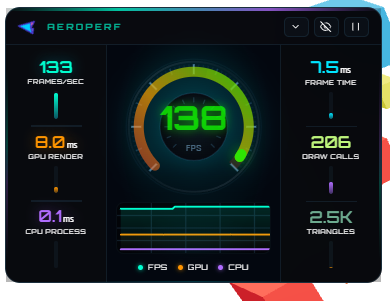
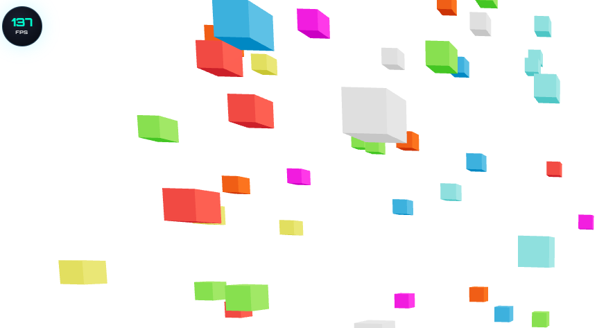
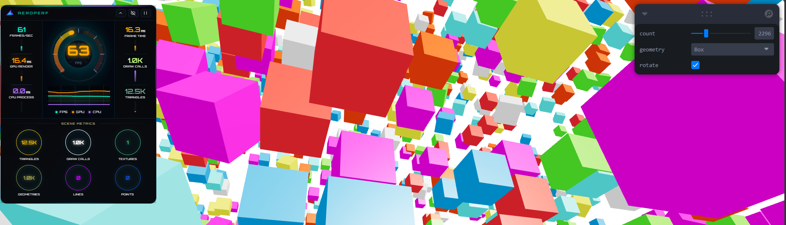

# ✈️ r3f-aeroperf

**A lightweight, real-time performance HUD for React Three Fiber , with full support for both WebGL and WebGPU renderers.**

Drop a single component inside your canvas`<Aero>` and get a modern-style overlay showing FPS, GPU/CPU frame timing, draw calls, triangle counts, VRAM usage, and more — updated live, every frame.

---

<p align="center">
  
</p>
<p >
  
</p>
<p >
  
</p>

---

## Features

- 🎯 **FPS / GPU time / CPU time** tracking with rolling averages
- 🕹️ **Circular speedometer gauge** (`AeroDial`) — click to cycle between FPS, GPU, and CPU views
- 📈 **Live scrolling graph** (`AeroScope`) plotting FPS/GPU/CPU history side-by-side
- 🧮 **Scene stats**: draw calls, triangles, geometries, textures, lines, points
- 💾 **VRAM estimation** based on texture and geometry buffer sizes
- ⚡ **WebGL & WebGPU renderer support**, with automatic detection and a scene-traversal fallback for WebGPU when renderer info isn't available
- 🚦 **Configurable warning thresholds** for FPS/GPU/CPU that trigger visual alerts
- 🏎️ **Overclocking flag** when FPS exceeds your target `fpsLimit`
- 🖥️ **4 dock positions** (`top-left`, `top-right`, `bottom-left`, `bottom-right`)
- 🔽 **Minimizable** to a small floating pill, **pausable**, and **expandable** to a detailed stats grid
- 🪶 **Minimal mode** for a compact, graph/gauge-free readout
- 🧠 **Global store powered by [Valtio](https://github.com/pmndrs/valtio)** — read metrics anywhere via `useAero()` or `getAero()`, independent of the panel UI
- 🎨 Ships with its own scoped CSS (`aero.css`), auto-injected on import

---

## Installation

```bash
npm install r3f-aeroperf
```

### Peer dependencies

```bash
npm install react react-dom three @react-three/fiber
```

---

## Quick Start

```jsx
import { Canvas } from '@react-three/fiber'
import { AeroPerf } from 'r3f-aeroperf'

export default function App() {
  return (
    <Canvas>
      <AeroPerf position="top-left" />

      {/* your scene */}
      <mesh>
        <boxGeometry />
        <meshStandardMaterial />
      </mesh>
    </Canvas>
  )
}
```

That's it — `<AeroPerf />` must be mounted **inside** the `<Canvas>` so it has access to the Three.js renderer and scene graph. It internally portals its UI out of the WebGL canvas into an overlay `<div>`, so it renders as normal DOM/HTML on top of your 3D scene.

---

## Usage

### Full configuration

```jsx
<AeroPerf
  position="bottom-right"
  showGraph={true}
  showGauge={true}
  minimal={false}
  showVRAM={true}
  logsPerSecond={10}
  openByDefault={true}
  fpsLimit={60}
  warnThresholds={{ fps: 30, gpu: 20, cpu: 20 }}
  className="my-aero-wrapper"
  style={{ zIndex: 9999 }}
/>
```

### Minimal mode

For a compact readout with no gauge or graph:

```jsx
<AeroPerf minimal showVRAM={false} />
```
---

## Props Reference

### `<AeroPerf />`

| Prop             | Type                                                          | Default      | Description                                                  |
|-------------------|----------------------------------------------------------------|--------------|----------------------------------------------------------------|
| `position`        | `'top-left' \| 'top-right' \| 'bottom-left' \| 'bottom-right'` | `'top-left'` | Corner to anchor the panel                                    |
| `showGraph`       | `boolean`                                                       | `true`       | Show the real-time FPS/GPU/CPU graph                          |
| `showGauge`       | `boolean`                                                       | `true`       | Show the circular speedometer gauge                           |
| `minimal`         | `boolean`                                                       | `false`      | Compact view — disables graph and gauge                       |
| `showVRAM`        | `boolean`                                                       | `false`      | Show the estimated VRAM usage bar                              |
| `logsPerSecond`   | `number`                                                        | `10`         | How often (per second) full scene stats refresh (1–60)        |
| `openByDefault`   | `boolean`                                                       | `true`       | Start expanded; `false` starts as a minimized pill             |
| `fpsLimit`        | `number`                                                        | `60`         | Target FPS used to flag "overclocking"                        |
| `warnThresholds`  | `{ fps?: number, gpu?: number, cpu?: number }`                  | `{}`         | Values below/above which metrics are flagged as alerts         |
| `className`       | `string`                                                        | —            | CSS class applied to the portal wrapper                        |
| `style`           | `CSSProperties`                                                 | —            | Inline style applied to the portal wrapper                     |

---

## Notes

- `AeroPerf` / `AeroCore` **must** be rendered inside a react-three-fiber `<Canvas>` — they rely on `useThree()` for access to the renderer and scene.
- The panel UI itself is portaled out into regular DOM via `AeroMount`, so it isn't subject to the WebGL canvas's rendering/pointer-event constraints.
- On WebGPU renderers, if `gl.info.render` draw-call data isn't available, the library falls back to a manual scene traversal to compute draw calls, triangles, geometries, and textures.
- Metric history is stored as three fixed-length (120-sample) circular buffers, so the graph memory footprint stays constant regardless of runtime duration.

## License

MIT © Siddhant Singh
